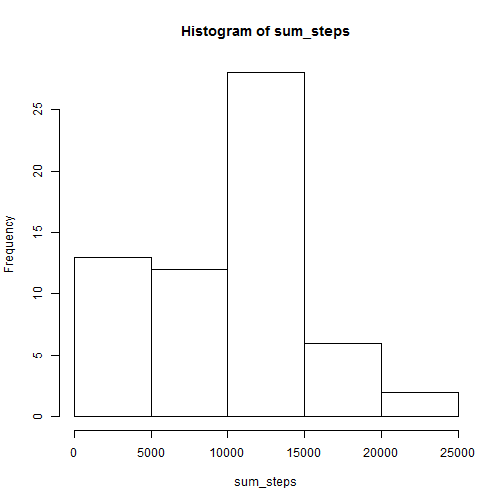
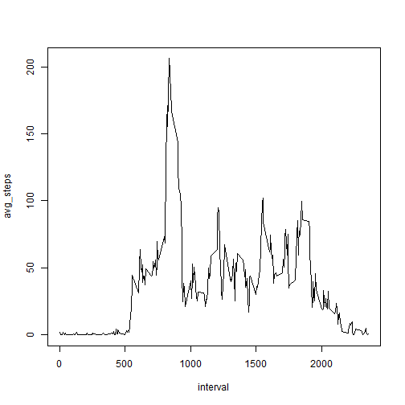
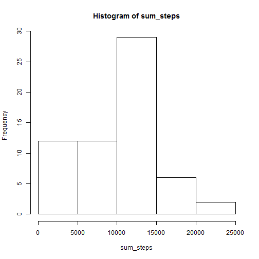
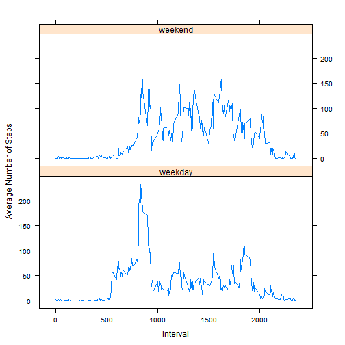

Reproducible Research: Peer Assessment 1
========================================================

## Loading and preprocessing the data
For this assignment we are requested to load the data in the activity.csv file provided.  The data file, activity.csv, has been put into the current working directory, and so we load it up using 'read.csv'.


```r
a <- read.csv("C:/Users/Stephen/Documents/activity.csv")
```


We can tell it loaded successfully because we can see that our variable has 17,568 rows and three columns, as described by the assignment.


```r
str(a)
```

```
## 'data.frame':	17568 obs. of  3 variables:
##  $ steps   : int  NA NA NA NA NA NA NA NA NA NA ...
##  $ date    : Factor w/ 61 levels "2012-10-01","2012-10-02",..: 1 1 1 1 1 1 1 1 1 1 ...
##  $ interval: int  0 5 10 15 20 25 30 35 40 45 ...
```


## What is the mean total number of steps taken per day?

We'd like to know the mean and median "total number of steps taken per day". I interpret that as the overall mean and median of the sum of the steps recorded each day, not the mean and median of the steps taken during each inteval each day.  To do this, I simply calculate the sum of the steps each day, and then take the mean and median of that set.  

In addition, we are asked to provide a histogram of the total number of steps taken each day.  That will be provided first, and is accomplished by calculating the sum of the steps each day and then just using the hist() function to present the histogram.


```r
# get the total number of steps taken per day
sum_steps <- tapply(a$steps, a$date, sum, na.rm = TRUE)
# histogram it
hist(sum_steps)
```

 

```r

# calculate the mean total number of steps taken per day
mean_steps <- mean(sum_steps)
# calculate the median total number of steps taken per day
median_steps <- median(sum_steps)
```


We find that the mean number of steps taken each day is **9,354** steps and the median number of steps taken each day is **10,395** steps.


## What is the average daily activity pattern?
To answer this question we are asked to get the average number of steps taken per 5-minute interval across all days, plot it as a line chart, and identify the interval which has the highest average number of steps.

First let's get the average number of steps per 5-minute interval.


```r
# get the mean number of steps taken per day per interval
avg_steps <- tapply(a$steps, a$interval, mean, na.rm = TRUE)
```


Now let's plot it.


```r
# get the interval vector for the x axis
interval = dimnames(avg_steps)[[1]]

# plot interval versus avg steps
plot(interval, avg_steps, type = "l")
```

 


And finally, find the interval with the maximum average number of steps.


```r
max_avg_steps <- max(avg_steps)

max_interval <- interval[match(max(avg_steps), avg_steps)]
```


The maximum average number of steps is **206** and the 5-minute interval in which that occurs is **835**.


## Imputing missing values
When we look at this data we find that there are **2,304** missing values in the dataset.  The strategy we are going to use to replace these missing values is to use the average number of steps for that interval, a number we just computed above.  


```r

# copy our original data
b <- a

# find indices with missing values for steps
row_with_missing_steps <- which(is.na(b[, "steps"]))

# fill those in with the average value
b[row_with_missing_steps, "steps"] <- avg_steps[row_with_missing_steps]

# get total number of steps per day from the new set
sum_steps <- tapply(b$steps, b$date, sum, na.rm = TRUE)

# histogram it
hist(sum_steps)
```

 

```r


# calculate the mean total number of steps taken per day
mean_steps_2 <- mean(sum_steps)
# calculate the median total number of steps taken per day
median_steps_2 <- median(sum_steps)
```


We find that the mean is **9,531** steps and the median is **10,439** steps. These are slightly higher than the values calculated previously, specifically **9,354** and **10,395**.  


## Are there differences in activity patterns between weekdays and weekends?
For this last part we are asked to use the filled-in dataset, and create a panel plot to show if the activity patterns change between weekdays and weekends.  For the plot, we will use the lattice library.  (Please pardon all the machinations I went through to get the data in the format required for plotting, my R skills are rusty after a short break from classes for the holiday.)


```r
# load the lattice library
library(lattice)
```

```
## Warning: package 'lattice' was built under R version 3.1.1
```

```r

# first convert the factors to dates
b[, "date"] <- as.Date(b[, "date"], "%Y-%m-%d")

# find the weekends
weekend_rows <- weekdays(b$date) %in% c("Saturday", "Sunday")

# create a vector of all weekdays
w <- rep("weekday", length(b$steps))

# mark the weekends
w[weekend_rows == TRUE] <- "weekend"

# add this to the filled-in dataset
c <- cbind(b, w)

# compute the average number of steps per interval for weekend days only
avg_weekend_steps <- tapply(c[w == "weekend", "steps"], c[w == "weekend", "interval"], 
    mean, na.rm = TRUE)

weekend_interval = dimnames(avg_weekend_steps)[[1]]

# compute the average number of steps per interval for weekday days only
avg_weekday_steps <- tapply(c[w == "weekday", "steps"], c[w == "weekday", "interval"], 
    mean, na.rm = TRUE)

weekday_interval = dimnames(avg_weekday_steps)[[1]]

# we need to put this into a data frame for lattice plotting
wdx <- as.numeric(weekday_interval)
wdy <- as.numeric(avg_weekday_steps)

wex <- as.numeric(weekend_interval)
wey <- as.numeric(avg_weekend_steps)

d <- rbind(data.frame(weekday_type = "weekday", interval = wdx, avg_steps = wdy), 
    data.frame(weekday_type = "weekend", interval = wex, avg_steps = wey))

# now plot using lattice plotting
xyplot(avg_steps ~ interval | weekday_type, data = d, layout = c(1, 2), xlab = "Interval", 
    ylab = "Average Number of Steps", type = "l")
```

 


As we can see by the plot above, the average number of steps taken seems to be slightly higher over most 5-minute intervals that are waking hours.  There does seem to be a difference in activity patterns between weekdays and weekends, with weekends being more active than weekdays.


